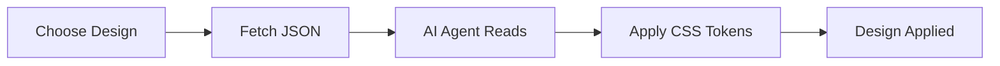
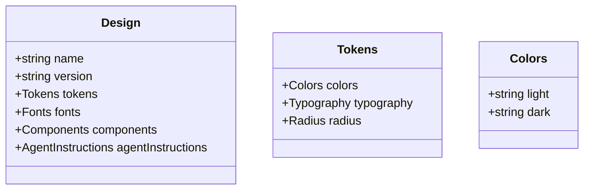

<p align="center">
  
</p>

# Sleek UI Design Systems

[](https://github.com/luongnv89/sleek-ui/stargazers)
[](https://luongnv.com/sleek-ui)
[](LICENSE)

**The Unsplash of Design Systems for AI Agents**

Paste a design URL, get a professional UI system. Sleek-ui provides curated, accessible design systems that AI agents can apply to any web project.

[**View Designs →**](#available-designs)

---

## How It Works



1. **Pick a design** from the catalog
2. **Copy the URL** (e.g., `https://luongnv.com/sleek-ui/designs/editorial-dark.json`)
3. **Tell your AI agent** to apply the design
4. The agent sets CSS custom properties and component styles

---

## Available Designs

| Design | Vibe | Mode | URL |
|--------|------|------|-----|
| Editorial Dark | Sophisticated, muted purples | Dark | [JSON](https://luongnv.com/sleek-ui/designs/editorial-dark.json) |
| Warm SaaS | Friendly, amber tones | Light | [JSON](https://luongnv.com/sleek-ui/designs/warm-saas.json) |
| Neo Brutalist | Bold, high contrast | Light | [JSON](https://luongnv.com/sleek-ui/designs/neo-brutalist.json) |
| Swiss Clean | Precise, minimal, corporate | Light | [JSON](https://luongnv.com/sleek-ui/designs/swiss-clean.json) |
| Deep Ocean | Immersive, deep navy blues | Dark | [JSON](https://luongnv.com/sleek-ui/designs/deep-ocean.json) |

---

## Quick Start

**1. Fetch a design:**
```bash
curl https://luongnv.com/sleek-ui/designs/editorial-dark.json
```

**2. Apply with your AI agent:**
```
Fetch https://luongnv.com/sleek-ui/designs/editorial-dark.json
and apply this design system to my project.
```

**3. The agent will:**
- Set CSS custom properties on `:root` and `.dark`
- Add Google Fonts via `<link>` tag
- Apply component styles for Tailwind + shadcn/ui

---

## Usage Examples

### Before (default browser styles)
```html
<button>Click me</button>
<div class="card">Content</div>
```

### After (applying Editorial Dark)
```css
:root {
  --background: 0 0% 100%;
  --foreground: 240 10% 3.9%;
  --primary: 245 90% 73%;
  --radius: 0.375rem;
}
.dark {
  --background: 240 33% 14%;
  --foreground: 0 0% 95%;
}
button {
  background: hsl(var(--primary));
  color: hsl(var(--primary-foreground));
  border-radius: var(--radius);
}
```

---

## Tech Stack

| Layer | Technology |
|-------|------------|
| Frontend | React 18.3 + TypeScript |
| Build Tool | Vite 5.4 |
| Styling | Tailwind CSS + shadcn/ui |
| Schema | JSON Schema (design.v1.json) |

---

## Project Structure

```
public/
├── designs/       # JSON design files
├── previews/      # Thumbnail images
├── schema/        # JSON Schema for validation
└── logo/          # Brand assets
```

---

## Design Schema

Each design follows `design.v1.json`:



---

## Agent Prompt Template

```
Fetch https://luongnv.com/sleek-ui/designs/{slug}.json
and apply this design system to my project.
```

The agent will:
1. Set `--background`, `--foreground`, `--primary`, etc.
2. Set `--radius` from tokens
3. Load fonts via `<link>` tag
4. Apply component styles

---

## Get Started

[**View all designs →**](https://luongnv.com/sleek-ui)

[**Brand Showcase →**](https://luongnv.com/sleek-ui/logo/brand-showcase.html)

[**GitHub →**](https://github.com/luongnv89/sleek-ui)

MIT Licensed

---

<details>
<summary>Full Documentation</summary>

## Supported AI Agents

### Claude Code
1. Run `claude`
2. Paste: `Fetch https://luongnv.com/sleek-ui/designs/{slug}.json and apply this design system`

### Cursor
1. Open Composer (Cmd+K)
2. Paste: `Fetch https://luongnv.com/sleek-ui/designs/{slug}.json and apply this design system`

### Codex CLI
1. Run `codex`
2. Paste: `Fetch https://luongnv.com/sleek-ui/designs/{slug}.json and apply this design system`

## Custom Domain

Designs are also served from `https://luongnv.com/sleek-ui/designs/{slug}.json`

## Development

```bash
npm run dev      # Start dev server
npm run build    # Build for production
npm run preview  # Preview build
```

## License

MIT

</details>
