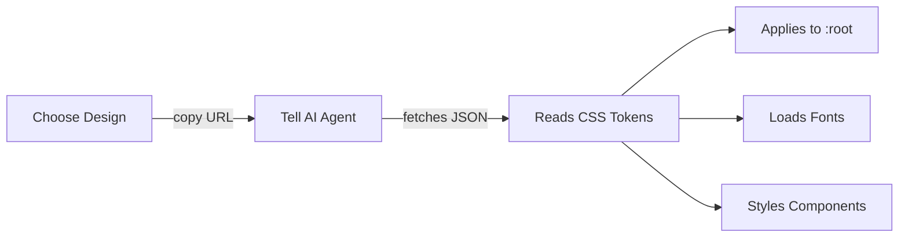
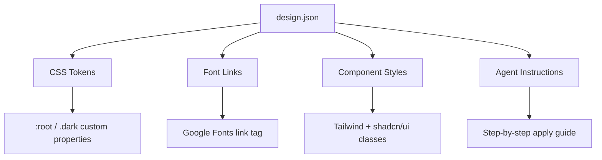
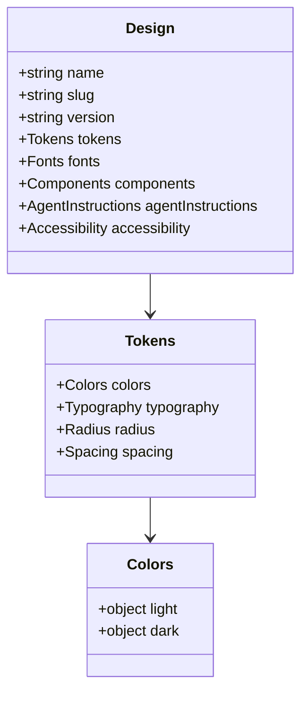

<p align="center">
  <picture>
    <source media="(prefers-color-scheme: dark)" srcset="https://luongnv.com/sleek-ui/logo/logo-white.svg">
    <source media="(prefers-color-scheme: light)" srcset="https://luongnv.com/sleek-ui/logo/logo-black.svg">
    
  </picture>
</p>

[](https://github.com/luongnv89/sleek-ui/stargazers)
[](https://luongnv.com/sleek-ui)
[](LICENSE)
[](https://luongnv.com/sleek-ui)

# Professional design systems for your AI agent

60+ production-grade design systems — Stripe, Linear, Vercel, Notion and more — as clean JSON. Give your agent one URL and it applies colors, typography, spacing, and component styles.

You build fast with AI. Now ship interfaces that don't look generic.

[**Browse designs →**](https://luongnv.com/sleek-ui) · [**Quick Start →**](#quick-start)

---

## How It Works (Your 3-Step Plan)



Browse. Copy the prompt. Paste it once. The agent applies tokens, fonts, radius, and shadcn component styles for you. No design tools required.

---

## Design Catalog

60+ designs covering brand-faithful recreations and original systems:

| Category | Designs |
|---|---|
| Dev tools | Vercel, Linear, Cursor, Raycast, Warp, Expo, Sentry, Supabase, PostHog |
| AI products | Claude, Cohere, Mistral, Ollama, Replicate, Minimax, ElevenLabs, Runway |
| SaaS | Stripe, Notion, Intercom, Resend, Webflow, Figma, Framer, Miro |
| Enterprise | IBM, BMW, Coinbase, Kraken, Revolut, Wise, Uber, HashiCorp, MongoDB |
| Original | Editorial Dark, Warm SaaS, Neo Brutalist, Swiss Clean, Deep Ocean, Glassmorphic |

Glassmorphic is an original design inspired by glassmorphism / frosted-glass directions from designdotmd.directory (adapted to Sleek UI's token schema and quality bar).

---

## Quick Start

Pick a design from the catalog:

```
https://luongnv.com/sleek-ui/designs/{slug}.json
```

Tell your AI agent:

```
Fetch https://luongnv.com/sleek-ui/designs/stripe.json
and apply this design system to my project.
```

That's it. The agent reads the JSON and applies all tokens.

---

## What Gets Applied



### Before / After

```css
/* Before: browser defaults */
button { }

/* After: applying stripe.json */
:root {
  --background: 0 0% 100%;
  --foreground: 215 25% 27%;
  --primary: 227 100% 59%;
  --radius: 0.375rem;
}
.dark {
  --background: 215 28% 17%;
  --foreground: 210 40% 98%;
}
button {
  background: hsl(var(--primary));
  border-radius: var(--radius);
}
```

---

## Design Schema

Each JSON file follows `design.v1.json`:



Colors use shadcn/ui HSL format: `"240 33% 14%"` — no `hsl()` wrapper, matches the `hsl(var(--token))` pattern.

---

## Get Started

[**View all designs →**](https://luongnv.com/sleek-ui)

[**Browse brand showcase →**](https://luongnv.com/sleek-ui/logo/brand-showcase.html)

[**GitHub →**](https://github.com/luongnv89/sleek-ui)

Apache 2.0 Licensed

---

<details>
<summary>Agent-specific usage (Claude Code, Cursor, Codex CLI)</summary>

### Claude Code

```
Fetch https://luongnv.com/sleek-ui/designs/{slug}.json
and apply this design system to my project.
```

### Cursor

Open Composer (Cmd+K), then paste:

```
Fetch https://luongnv.com/sleek-ui/designs/{slug}.json
and apply this design system to my project.
```

### Codex CLI

```
Fetch https://luongnv.com/sleek-ui/designs/{slug}.json
and apply this design system to my project.
```

</details>

<details>
<summary>Development setup</summary>

### Tech Stack

| Layer | Technology |
|---|---|
| Frontend | React 18.3 + TypeScript |
| Build | Vite 5.4 |
| Styling | Tailwind CSS 3.4 + shadcn/ui |
| Schema | JSON Schema (design.v1.json) |
| Deploy | GitHub Pages + GitHub Actions |

### Local Development

Install dependencies:

```bash
npm install
```

Start dev server:

```bash
npm run dev
```

Build for production:

```bash
npm run build
```

Validate design JSON files:

```bash
npm run validate:designs
```

### Project Structure

```
public/
├── designs/       # JSON design files (55+)
├── previews/      # Thumbnail images
├── schema/        # JSON Schema for validation
└── logo/          # Brand assets
src/               # React app source
.github/workflows/ # CI/CD (GitHub Pages deploy)
```

### Adding a New Design

1. Create `public/designs/{slug}.json` following `public/schema/design.v1.json`
2. Run `npm run validate:designs` to confirm schema compliance
3. Submit a PR

</details>
