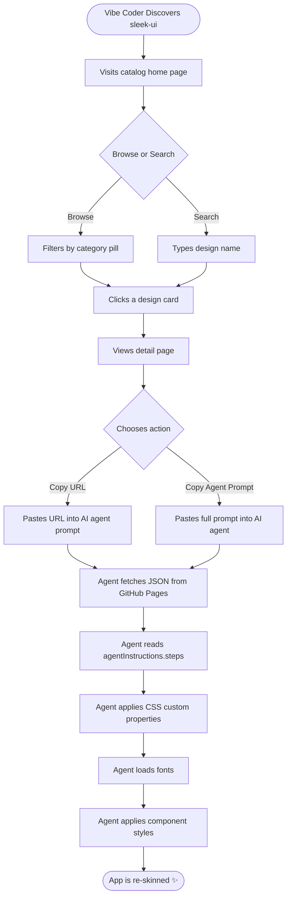
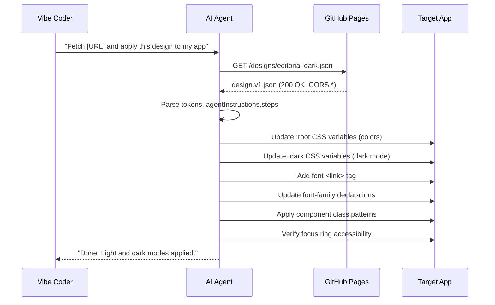
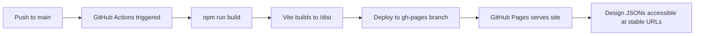
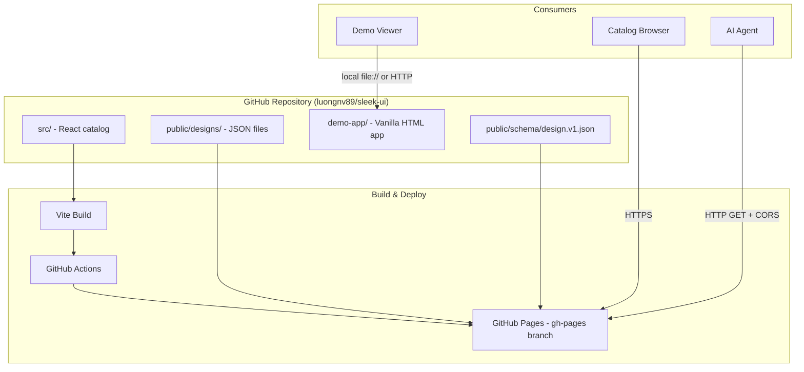

# Product Requirements Document: sleek-ui

**Version:** 1.0.0  
**Status:** APPROVED — Ready to Implement  
**Created:** 2026-03-26  
**Author:** Luong NGUYEN  
**Source:** gstack-design.md (Eng Review CLEARED)

---

## Table of Contents

1. [Product Overview](#1-product-overview)
2. [User Personas](#2-user-personas)
3. [Feature Requirements](#3-feature-requirements)
4. [User Flows](#4-user-flows)
5. [Non-Functional Requirements](#5-non-functional-requirements)
6. [Technical Specifications](#6-technical-specifications)
7. [Analytics & Monitoring](#7-analytics--monitoring)
8. [Release Planning](#8-release-planning)
9. [Open Questions & Risks](#9-open-questions--risks)
10. [Appendix](#10-appendix)

---

## 1. Product Overview

### 1.1 Vision

**sleek-ui** is the "Unsplash of Design Systems for AI Agents" — a curated, URL-addressable library of professional design tokens that lets any vibe coder re-skin their entire application in a single AI agent command.

> **The Magic Moment:** A vibe coder pastes one URL into their AI agent (Claude Code, Cursor, Codex), and their entire app gets transformed — colors, typography, spacing, dark/light mode, everything. One link. One prompt. Professional result.

### 1.2 Problem Statement

Vibe coders (people using AI tools to build apps) can ship functional software but consistently end up with generic, ugly UIs. They:
- Have no design skills and won't learn them
- Can't use Figma or Tokens Studio (locked in proprietary tools)
- Lack access to designs optimized for AI agent consumption via URL
- Are blocked from making their apps look professional by the design/dev gap

**Root cause:** No tasteful, machine-readable design format exists that AI agents can fetch and apply end-to-end.

### 1.3 Target Users

| Persona | Description |
|---------|-------------|
| Primary | Vibe coders using Claude Code, Cursor, Bolt, or v0 |
| Secondary | Indie hackers and solo founders building Tailwind + shadcn projects |
| Tertiary | Design system maintainers who want to distribute styles via URL |

### 1.4 Business Objectives

1. Validate the core hypothesis: AI agents can fetch a URL and reliably re-skin a Tailwind + shadcn app
2. Build a browsable catalog of curated design systems
3. Create a viral "magic moment" demo that generates organic sharing
4. Establish sleek-ui as the de facto URL-addressable design format for AI agents

### 1.5 Success Metrics

| Metric | MVP Target | Phase 2 Target |
|--------|------------|----------------|
| Agent loop success rate | ≥ 1 working demo | ≥ 2 agents verified |
| Designs available | 3 | 5 |
| Before/after compelling | Subjectively dramatic | Documented screenshots |
| Public shares | 1 viral post | Engagement on HN or Twitter/X |
| Catalog usable | Browse + copy URL | Search + filter working |

---

## 2. User Personas

### Persona 1: "The Vibe Coder" — Alex

- **Age:** 24–35
- **Role:** Non-designer indie hacker / solo SaaS founder
- **Tools:** Claude Code, Cursor, Bolt, v0, GitHub Copilot
- **Skills:** Can write prompts, basic JavaScript, comfortable with Tailwind
- **Pain:** Ships functional apps that look like 1998 — kills conversion, kills confidence
- **Goal:** Transform any app into a professionally designed product in under 5 minutes, without learning design
- **Quote:** _"I just want my app to not look terrible. I'll use whatever magic makes that happen."_
- **Workflow:** Finds sleek-ui on Twitter, copies the JSON URL, pastes it into Claude Code and says "apply this design"
- **Success:** App looks completely different — new colors, fonts, component styles — in one agent session

### Persona 2: "The Design-Curious Developer" — Jordan

- **Age:** 28–40
- **Role:** Full-stack developer who appreciates good design but doesn't specialize in it
- **Tools:** Cursor, GitHub, standard Tailwind + shadcn setup
- **Skills:** Comfortable with React, TypeScript, CSS; understands tokens but doesn't create them
- **Pain:** Knows their app looks generic but doesn't know *how* to make it look better
- **Goal:** Browse a catalog, pick a vibe that matches their product, apply it with the agent
- **Quote:** _"I know shadcn works. I just need the right theme."_
- **Workflow:** Visits sleek-ui catalog, browses designs by category, previews both modes, copies agent prompt
- **Success:** Can compare tokens, understand what changed, and reproduce or tweak the result

### Persona 3: "The Design System Distributor" — Casey

- **Age:** 30–45
- **Role:** Design engineer at a startup or open-source maintainer
- **Tools:** Figma, Style Dictionary, shadcn, GitHub Pages
- **Skills:** Creates design systems professionally, understands DTCG tokens
- **Pain:** No standard, AI-friendly format to distribute design tokens via URL; existing solutions are proprietary
- **Goal:** Publish their design system via sleek-ui format so AI agents can consume it
- **Quote:** _"I want my design system to be fetchable by anyone's AI agent, not locked in Figma."_
- **Workflow:** (Phase 3) Contributes a design JSON via GitHub PR; community uses it
- **Success:** Their design system URL is shared and applied across many projects

---

## 3. Feature Requirements

### 3.1 Feature Matrix (MoSCoW)

| ID | Feature | Priority | Phase |
|----|---------|----------|-------|
| F01 | `design.v1.json` schema definition | Must | 1 |
| F02 | 3 hand-crafted design files (Editorial Dark, Warm SaaS, Neo Brutalist) | Must | 1 |
| F03 | Static JSON served via GitHub Pages with CORS | Must | 1 |
| F04 | Catalog home page — grid of design cards | Must | 1 |
| F05 | Catalog detail page — full token table, previews, copy actions | Must | 1 |
| F06 | Demo app ("ugly" before-app) for before/after testing | Must | 1 |
| F07 | Agent loop end-to-end test (Claude Code confirmed working) | Must | 1 |
| F08 | Category filter and search on catalog | Should | 1 |
| F09 | 2 additional designs (Swiss Clean, Deep Ocean) | Should | 2 |
| F10 | Before/after screenshots for each design | Should | 2 |
| F11 | GitHub Actions CI/CD to GitHub Pages | Should | 2 |
| F12 | README with multi-agent usage instructions | Should | 2 |
| F13 | Demo video recording for social share | Should | 2 |
| F14 | Tailwind config overrides field in JSON | Could | 2 |
| F15 | Versioned design URLs (e.g. `@1.0.0`) | Could | 2 |
| F16 | MCP server for direct agent integration | Won't (MVP) | 3 |
| F17 | Maintainer pipeline (image → AI extraction → JSON) | Won't (MVP) | 3 |
| F18 | Community contribution workflow (GitHub PRs) | Won't (MVP) | 3 |
| F19 | Design benchmark/test mode | Won't (MVP) | 3 |

### 3.2 Core Feature Details

#### F01 — `design.v1.json` Schema

**User Story:** As an AI agent, I need a self-contained JSON file at a stable URL that tells me everything I need to re-skin an app: colors (light/dark), typography, spacing, radius, shadows, component hints, and step-by-step natural language instructions.

**Acceptance Criteria:**
- [ ] Schema published at `https://luongnv89.github.io/sleek-ui/schema/design.v1.json`
- [ ] Each design JSON validates against the schema
- [ ] Colors use HSL without `hsl()` wrapper (shadcn convention)
- [ ] `agentInstructions.steps` is a numbered, complete steps array
- [ ] Both `light` and `dark` color sets are present
- [ ] `fonts.urls` field contains loadable Google Fonts URLs
- [ ] `components` field contains Tailwind class hints for button, card, input

**Schema Fields:**

```
$schema, name, version, description, categories, author
tokens.colors.light / dark (17 semantic color roles each)
tokens.typography.fontFamily, fontSize, lineHeight
tokens.spacing.unit, scale
tokens.radius (sm, default, lg, full)
tokens.shadows (sm, default, lg)
fonts.google[], fonts.urls[]
accessibility.contrastTarget, focusRing, reducedMotion
components.button.primary/secondary/ghost, card, input
agentInstructions.summary, colorFormat, defaultMode, spacingGrid, fontInstallation, targetFramework, steps[]
preview.thumbnail, screenshots.light/dark
```

---

#### F02 — 3 Initial Designs

**User Story:** As a vibe coder, I want at least 3 distinct, high-quality design options so I can pick one that fits my product's personality.

| Design | Vibe | Categories | Default Mode |
|--------|------|-----------|--------------|
| Editorial Dark | Sophisticated, muted purples, clean typography | dark, minimal | dark |
| Warm SaaS | Friendly, amber tones, readable and corporate | warm, corporate | light |
| Neo Brutalist | Bold, high contrast, playful and opinionated | bold, playful | light |

**Acceptance Criteria:**
- [ ] Each design passes JSON schema validation
- [ ] Primary colors are visually distinct across designs
- [ ] Each design has both `light` and `dark` token sets
- [ ] Each design includes thumbnail and screenshot paths
- [ ] Served at `https://luongnv89.github.io/sleek-ui/designs/{name}.json`
- [ ] CORS verification passes (fetch from browser console confirms `Access-Control-Allow-Origin: *`)

---

#### F04 & F05 — Catalog Website

**User Story (Home):** As a vibe coder, I want to browse all available designs in a grid, filter by category, and search by name so I can find the right style quickly.

**User Story (Detail):** As a developer, I want to see light/dark mode previews, component examples, the full token table, and one-click copy of the design URL and agent prompt.

**Acceptance Criteria — Home:**
- [ ] Design cards display: thumbnail, name, categories as pills, color swatches (primary, secondary, accent)
- [ ] Category filter pills (dark, light, minimal, warm, bold, playful, corporate) working
- [ ] Text search filters by design name in real time
- [ ] Each card links to `/design/:slug`
- [ ] Responsive grid (1 col mobile, 2 col tablet, 3 col desktop)

**Acceptance Criteria — Detail:**
- [ ] Light/dark mode toggle with live preview switch
- [ ] Component previews: Button (primary, secondary, ghost), Input, Badge, Card
- [ ] Full token table (all color roles with hex + HSL values)
- [ ] "Copy URL" button copies the JSON endpoint URL
- [ ] "View JSON" opens the raw JSON in a new tab
- [ ] "Copy Agent Prompt" copies a ready-to-paste agent instruction
- [ ] Back navigation to home

---

#### F06 — Demo App (Before State)

**User Story:** As someone watching the demo, I want to see an intentionally ugly "before" app so the transformation is dramatic and compelling.

**Acceptance Criteria:**
- [ ] Plain HTML + vanilla CSS + minimal JS (no framework)
- [ ] Dashboard layout: sidebar nav, stats cards, data table, settings form
- [ ] Styled with browser defaults and generic gray CSS
- [ ] Lives in `demo-app/` directory, NOT part of the Vite build
- [ ] Can be opened as a local file or served separately
- [ ] Contains enough UI surface area to showcase the transformation (5+ component types)

---

#### F07 — Agent Loop Verification

**User Story:** As the maintainer, I need proof that the core hypothesis works before launch — an AI agent must be able to fetch a design URL and successfully re-skin the demo app.

**Acceptance Criteria:**
- [ ] Test with Claude Code: fetch editorial-dark.json, apply to demo app, screenshot result
- [ ] Test with at least one other agent (Cursor or Codex)
- [ ] "Recognizable fidelity" checklist passes:
  - Primary color matches token
  - Font family matches token
  - Border radius matches token
  - Dark/light mode toggles correctly
  - Overall aesthetic is identifiably the intended design
- [ ] Document any agent-specific quirks (redirect handling, timeout, JSON parsing)
- [ ] Results documented in README or demo doc

---

## 4. User Flows

### 4.1 Primary Flow — Vibe Coder Applies a Design



### 4.2 Secondary Flow — Catalog Browsing


### 4.3 Agent Execution Flow



### 4.4 CI/CD Deployment Flow



---

## 5. Non-Functional Requirements

### 5.1 Performance

| Requirement | Target |
|-------------|--------|
| Design JSON file size | ≤ 20 KB per file |
| Catalog home page load | ≤ 2s on 3G |
| Time to first meaningful paint | ≤ 1.5s |
| JSON fetch latency (GitHub Pages) | ≤ 500ms globally |
| CORS fetch success rate | 100% (verified on GitHub Pages) |

### 5.2 Security

- Static-only deployment — no server-side code, no user data collection
- No authentication required
- No cookies or local storage of sensitive data
- Design JSONs are public and intentionally fetchable by any agent
- No API keys in source code or JSON files

### 5.3 Compatibility

| Target | Requirement |
|--------|-------------|
| Browsers | Chrome 90+, Firefox 90+, Safari 15+, Edge 90+ |
| AI Agents | Claude Code, Cursor, Codex (must all be able to HTTP GET the JSON) |
| Framework targets | Tailwind CSS + shadcn/ui (primary); vanilla CSS (partial support) |
| Deployment | GitHub Pages (CORS `*`), fallback: Cloudflare Pages or Netlify |
| Node version | LTS (18+) |

### 5.4 Accessibility

- **WCAG AA** contrast compliance for all color token combinations
- Focus ring specification: `2px solid var(--ring)` with `2px` offset
- Respect `prefers-reduced-motion`: disable all transitions and animations when set
- Catalog website must score ≥ 90 on Lighthouse Accessibility audit
- All interactive catalog elements must have unique, descriptive IDs

### 5.5 Reliability

- GitHub Pages uptime SLA: 99.9% (GitHub's guarantee)
- JSON URLs must remain stable across schema iterations
- No build step required for design JSON files (hand-authored, no pipeline to break)
- CORS behavior must be verified before launch and re-verified if GitHub Pages policy changes

---

## 6. Technical Specifications

### 6.1 Architecture Overview



### 6.2 Frontend — Catalog Website

| Concern | Decision |
|---------|----------|
| Framework | React 18 + Vite |
| Styling | TailwindCSS v3 + shadcn/ui |
| Language | JavaScript (JSX) |
| Routing | React Router v6, hash router (`#/`) for GitHub Pages |
| State | React useState / useEffect — no external state manager needed |
| Data | Static `src/data/designs.js` imports JSON files; no API calls |
| Icons | lucide-react |
| Build tool | Vite 5 |

**Component Structure:**

```
src/
├── components/
│   ├── DesignCard.jsx       # Grid card: thumbnail, name, categories, swatches
│   ├── DesignDetail.jsx     # Full detail: preview, tokens, copy actions
│   ├── CategoryFilter.jsx   # Filter pills
│   ├── SearchBar.jsx        # Real-time name search
│   ├── TokenTable.jsx       # Full color token display
│   └── CopyButton.jsx       # One-click clipboard copy with feedback
├── pages/
│   ├── Home.jsx             # Grid + filters
│   └── Detail.jsx           # Detail view
├── data/
│   └── designs.js           # Index: imports all design JSONs
├── App.jsx
└── main.jsx
```

### 6.3 Design JSON Format — `design.v1.json`

See full schema in §3.2 F01. Key decisions:

- **Colors:** HSL values as strings without `hsl()` wrapper (shadcn convention: `"240 33% 14%"`)
- **Agent Instructions:** Embedded numbered steps in `agentInstructions.steps[]`
- **Framework hints:** `components` field contains Tailwind class strings; non-Tailwind agents map semantically
- **Self-contained:** Every design file contains everything needed — no cross-file references

### 6.4 Demo App

- **Tech:** Plain HTML, vanilla CSS, minimal vanilla JS
- **Structure:** Sidebar nav, 4 stats cards, 1 data table, 1 settings form
- **Location:** `demo-app/index.html` — NOT part of Vite build
- **Purpose:** The "before" state for agent loop testing and demo video
- **Initial style:** Browser default fonts, gray/white palette, no design system

### 6.5 Infrastructure

| Component | Technology | Notes |
|-----------|-----------|-------|
| Hosting | GitHub Pages | Serves `/dist` and `/public` |
| CI/CD | GitHub Actions | Triggers on push to `main` |
| Branch strategy | `main` (source) → `gh-pages` (deployment) |  |
| Domain | `luongnv89.github.io/sleek-ui` | Custom domain optional in Phase 2 |
| CORS | GitHub Pages default (`*`) | Verify pre-launch; fallback to Cloudflare Pages |

### 6.6 JSON Schema Validation

- Schema file: `public/schema/design.v1.json` (JSON Schema Draft 7)
- Pre-commit hook validates all JSON files in `public/designs/` against schema
- CI step also validates on every push

### 6.7 File Structure

```
sleek-ui/
├── public/
│   ├── designs/
│   │   ├── editorial-dark.json
│   │   ├── warm-saas.json
│   │   └── neo-brutalist.json
│   ├── previews/
│   │   ├── editorial-dark-thumb.png
│   │   ├── editorial-dark-light.png
│   │   ├── editorial-dark-dark.png
│   │   └── (same pattern for other designs)
│   └── schema/
│       └── design.v1.json
├── src/
│   ├── components/
│   │   └── (see §6.2)
│   ├── pages/
│   ├── data/
│   │   └── designs.js
│   ├── App.jsx
│   └── main.jsx
├── demo-app/
│   └── index.html
├── .github/
│   └── workflows/
│       └── deploy.yml
├── index.html
├── vite.config.js
├── tailwind.config.js
├── package.json
└── README.md
```

---

## 7. Analytics & Monitoring

### 7.1 Key Metrics to Track

| Metric | How | Target |
|--------|-----|--------|
| Catalog page views | GitHub Pages analytics or Plausible (privacy-first) | Growing week-over-week |
| JSON file fetch count | GitHub Pages traffic or Cloudflare analytics | Proxy for agent usage |
| Most copied design | Client-side event (if analytics added) | Track for prioritizing new designs |
| GitHub stars | GitHub API | 100 in first month |
| Social shares | Manual tracking | 1 viral post with engagement |

### 7.2 Phase 1 Monitoring (Minimal)

- **CORS verification:** Manually fetch JSON from browser console before launch
- **Agent loop success:** Manual test with Claude Code and one other agent
- **GitHub Pages uptime:** Monitor via GitHub status page

### 7.3 Phase 2 Monitoring

- Add Plausible Analytics (privacy-first, no cookies) to catalog site
- Track: page views, design detail views, copy button clicks per design
- Alert: if GitHub Pages serves 404 for any design JSON (manual check weekly)

### 7.4 Success Dashboard (Post-Launch)

Key events to capture if analytics is added:
- `design_viewed` (which design, which mode)
- `url_copied` (design slug)
- `agent_prompt_copied` (design slug)
- `json_viewed` (design slug)
- `filter_applied` (category)
- `search_performed` (query length, results count)

---

## 8. Release Planning

### 8.1 Phase 1 — Prove the Magic (Week 1)

**Goal:** Validate that the core loop works end-to-end. Ship minimum catalog with 3 designs.

#### Milestones

| # | Task | Owner | Done? |
|---|------|-------|-------|
| 1.1 | Initialize Vite + React + TailwindCSS + shadcn project | Dev | ☐ |
| 1.2 | Define `design.v1.json` schema (JSON Schema Draft 7) | Dev | ☐ |
| 1.3 | Author `editorial-dark.json` | Dev | ☐ |
| 1.4 | Author `warm-saas.json` | Dev | ☐ |
| 1.5 | Author `neo-brutalist.json` | Dev | ☐ |
| 1.6 | Validate all 3 JSONs against schema | Dev | ☐ |
| 1.7 | Build `demo-app/` (ugly before-app) | Dev | ☐ |
| 1.8 | Build catalog home page (DesignCard grid + filter + search) | Dev | ☐ |
| 1.9 | Build catalog detail page (TokenTable, CopyButton, previews) | Dev | ☐ |
| 1.10 | Generate preview thumbnails for all 3 designs | Dev | ☐ |
| 1.11 | Deploy to GitHub Pages via GitHub Actions | Dev | ☐ |
| 1.12 | Verify CORS: `fetch('https://...editorial-dark.json')` from browser console | Dev | ☐ |
| 1.13 | Test agent loop with Claude Code — record result | Dev | ☐ |
| 1.14 | Test agent loop with Cursor or Codex — record result | Dev | ☐ |
| 1.15 | Document agent quirks in README | Dev | ☐ |

**Phase 1 Exit Criteria:**
- [ ] At least 1 agent can successfully re-skin the demo app using a design URL
- [ ] 3 designs are live and fetchable at stable URLs
- [ ] Catalog is browsable with working copy actions

---

### 8.2 Phase 2 — Polish & Launch (Week 2)

**Goal:** Ship 5 designs, before/after proof, and record the demo video for public launch.

| # | Task | Owner | Done? |
|---|------|-------|-------|
| 2.1 | Author `swiss-clean.json` | Dev | ☐ |
| 2.2 | Author `deep-ocean.json` | Dev | ☐ |
| 2.3 | Capture before/after screenshots for all 5 designs | Dev | ☐ |
| 2.4 | Write README with usage instructions for Claude Code, Cursor, Codex | Dev | ☐ |
| 2.5 | Add "Built with sleek-ui" badge to README | Dev | ☐ |
| 2.6 | Record demo video (before → agent command → after transformation) | Dev | ☐ |
| 2.7 | Evaluate adding `tailwindConfig` override field to schema | Dev | ☐ |
| 2.8 | Post to Twitter/X, Reddit r/webdev, Hacker News | Dev | ☐ |

**Phase 2 Exit Criteria:**
- [ ] 5 designs live
- [ ] Demo video published
- [ ] At least 1 public share with engagement

---

### 8.3 Phase 3 — Growth (Future, No Timeline)

- Maintainer pipeline: drop an inspiration image → AI extracts tokens → preview → publish
- Community contributions via GitHub PRs
- MCP server for direct agent tool integration (no URL copy needed)
- Design benchmark mode: each design JSON as a versioned style-transfer test case
- Versioned design URLs: `/designs/editorial-dark@1.0.0.json`

---

## 9. Open Questions & Risks

### 9.1 Open Questions

| # | Question | Status | Resolution |
|---|---------|--------|------------|
| OQ1 | Should the JSON format include `tailwindConfig` overrides? | Open | Evaluate in Phase 2 (F14) |
| OQ2 | Version strategy: should old design versions remain at versioned URLs? | Open | MVP: `version` field is informational only; versioned URLs deferred to Phase 3 |
| OQ3 | MCP integration timeline? | Resolved: deferred | Phase 3 only |
| OQ4 | Font loading strategy? | Resolved | `fonts.urls[]` + agent instruction to add `<link>` tag |

### 9.2 Assumptions

| # | Assumption | Validation Method |
|---|------------|-------------------|
| A1 | AI agents can reliably HTTP GET from GitHub Pages | Phase 1 — manual + 2-agent test |
| A2 | GitHub Pages serves `Access-Control-Allow-Origin: *` by default | Phase 1 — browser fetch test |
| A3 | Vibe coders will paste a URL into their agent if the result is good enough | Phase 2 — demo video engagement |
| A4 | 3-5 designs are enough for a compelling MVP | Phase 2 — qualitative feedback |
| A5 | shadcn HSL format is usable enough for non-shadcn projects | Phase 1 — agent instructions cover mapping |

### 9.3 Risks & Mitigations

| Risk | Likelihood | Impact | Mitigation |
|------|-----------|--------|------------|
| GitHub Pages changes CORS policy | Low | High | Move to Cloudflare Pages or Netlify with zero code changes (static files) |
| AI agents fail to correctly parse / apply the JSON | Medium | High | Embedded `agentInstructions.steps` reduce ambiguity; test with 2+ agents; document quirks |
| Schema over-engineering prevents quick iteration | Medium | Medium | Start with minimal schema; add fields behind `_note` convention |
| Demo doesn't look compelling enough for sharing | Medium | High | Invest in before/after screenshots; use real-world-looking demo app |
| Maintainer burnout on hand-crafting designs | Low | Medium | Quality over quantity; pipeline deferred; community contributions in Phase 3 |
| Fragmentation: agents interpret tokens differently | Medium | Medium | `agentInstructions.steps` is the safety net; document per-agent quirks |

---

## 10. Appendix

### 10.1 Competitive Analysis

| Solution | Strengths | Weaknesses vs. sleek-ui |
|---------|-----------|------------------------|
| shadcn themes | Massive ecosystem, CSS var compatible | Component-install model, not "re-skin whole app" |
| Figma Tokens | Complete design token workflow | Proprietary tool, no URL fetch, not AI-agent-native |
| Tokens Studio | DTCG-compatible, powerful | Figma plugin dependency, not URL-addressable |
| v0 themes | Integrated with Vercel ecosystem | v0-specific, not portable to any agent |
| Open Props | CSS custom property library | No agent instructions, no curated aesthetics |
| **sleek-ui** | URL-fetchable, agent-native, curated taste | Fewer designs, smaller ecosystem (for now) |

### 10.2 schema `design.v1.json` Color Roles Reference

| Token | Purpose |
|-------|---------|
| `background` | Page/app background |
| `foreground` | Primary text color |
| `primary` | Brand primary (buttons, CTAs) |
| `primary-foreground` | Text on primary backgrounds |
| `secondary` | Secondary actions/backgrounds |
| `secondary-foreground` | Text on secondary backgrounds |
| `muted` | Subtle backgrounds (e.g., chips, code blocks) |
| `muted-foreground` | Secondary/placeholder text |
| `accent` | Highlights and interactive states |
| `accent-foreground` | Text on accent backgrounds |
| `destructive` | Errors, deletes, danger states |
| `destructive-foreground` | Text on destructive backgrounds |
| `border` | Component borders |
| `input` | Input field borders |
| `ring` | Focus ring color |
| `card` | Card component background |
| `card-foreground` | Text on card backgrounds |

### 10.3 Agent Prompt Template

The following is the ready-to-paste agent prompt surfaced by the "Copy Agent Prompt" button in the catalog:

```
Fetch the design system at: https://luongnv89.github.io/sleek-ui/designs/{slug}.json

Read the JSON, then follow the steps in agentInstructions.steps to apply this design system to my project:
1. Set CSS custom properties from tokens.colors on :root (light) and .dark (dark mode)
2. Set --radius from tokens.radius.default
3. Load fonts by adding the Google Fonts URL from fonts.urls as a <link> tag
4. Set font-family from tokens.typography.fontFamily
5. Apply component styles from the components field (Tailwind class names for shadcn projects)
6. Ensure focus states match accessibility.focusRing specification
7. Test both light and dark modes

Target framework: Tailwind CSS + shadcn/ui. For other frameworks, map token names to CSS custom properties semantically.
```

### 10.4 Technical Glossary

| Term | Definition |
|------|-----------|
| Vibe coder | Developer who ships using AI tools primarily via prompts |
| Design token | A named, platform-agnostic design decision (color, spacing, etc.) |
| DTCG | Design Tokens Community Group — W3C standards body for token format |
| shadcn convention | HSL color format without `hsl()` wrapper, used as CSS custom properties |
| Agent loop | The end-to-end flow of an AI agent fetching a URL and applying a design |
| Magic moment | The instant transformation of an ugly app into a professionally designed one |
| `design.v1.json` | The custom sleek-ui schema file format per design |
| Hash router | React Router config that uses `#/` in URLs for GitHub Pages SPA compatibility |
| MCP | Model Context Protocol — agent tool integration protocol (Phase 3 feature) |

### 10.5 Revision History

| Version | Date | Author | Changes |
|---------|------|--------|---------|
| 1.0.0 | 2026-03-26 | Luong NGUYEN | Initial PRD — derived from gstack-design.md (Eng Review CLEARED) |
